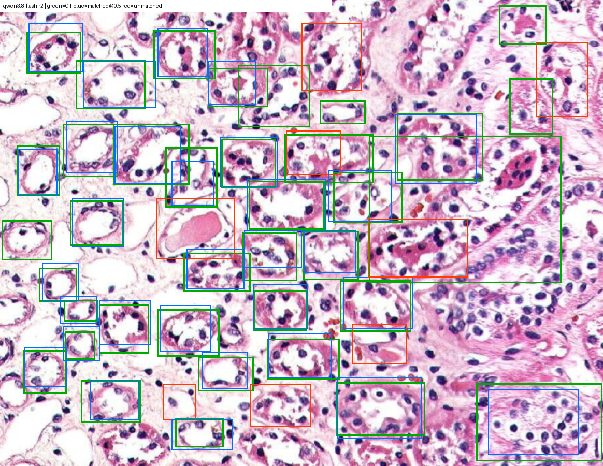
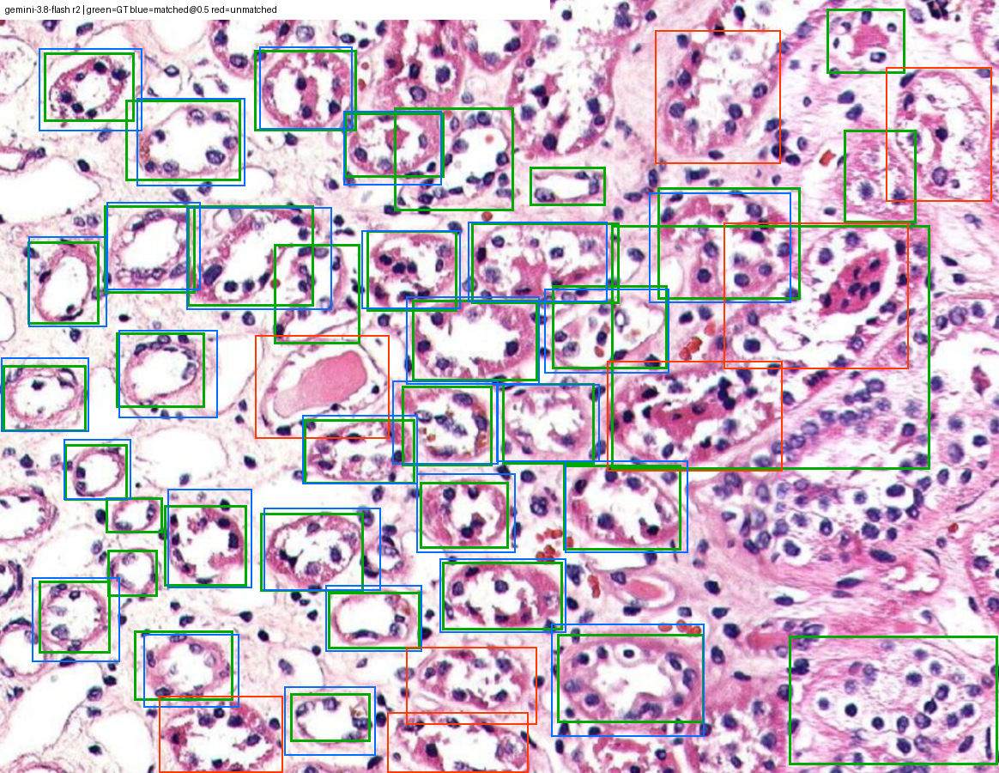

# 八个多模态模型，谁更适合框选肾小管？

思语视觉 · 2026-10-07。用一张H&E肾脏组织图，对照作者手工画的37个框，比较模型的定位、漏检、误检、响应时间和实际API调用费。代码、三个提示词、干净原图、人工框、30次调用记录、预测框、叠加图和指标均随仓库提供。

这是单图探索性评测。两轮设置分开报告，不把补测与主实验拼成同条件排行榜。

## 看结果

- [主实验：8模型各3次](results/20261007-main/summary.md)，共用提示词。严格F1@IoU0.5前三为Qwen3.8 Flash 0.796、GPT-6.1 Sol 0.735、Gemini3.8 Flash 0.534。
- [补测：Gemini/Kimi各3次](results/20261007-native/summary.md)，使用各自事前固定的坐标格式。Gemini均值0.764；Kimi三次为0.743、0.067、0.769，均值0.526，失败次保留。
- Qwen Flash主实验平均$0.0021/次，延迟中位数44.4秒；Gemini补测$0.0101/次、27.2秒；GPT Sol主实验$0.0264/次、55.5秒。速度受路由、负载、输出与推理token等影响，推理强度未统一。
- 自动标注选型可以优先继续验证Qwen的低成本和Gemini的响应速度；GPT Sol召回率0.901，但精确率0.621，需要删除更多多余框。尚未实测人工修订时间，也未训练下游专用模型。

### 示例图

以下均选各自轮次严格F1居中的一次，不是最好的一次。绿色为人工参考，蓝色为IoU0.5下匹配的预测，红色为未匹配预测。原始未画框输入在[data/input/](data/input/)。

Qwen3.8 Flash，主实验r2：



Gemini3.8 Flash，补测r2：



## 先离线复算，不需要API密钥

要求Python3.11及uv，CPU即可；无需GPU、模型权重或其他子项目的submodule。以下在本项目目录执行：

```powershell
git clone https://github.com/siyuvision/ia4u-deep-dive.git
cd ia4u-deep-dive/projects/mllm-renal-tubule-bbox
uv venv repo/.venv --python 3.11
uv pip install --python repo/.venv/Scripts/python.exe -r repo/requirements.lock.txt
repo/.venv/Scripts/python.exe -m pytest repo/tests -q
repo/.venv/Scripts/python.exe repo/scripts/evaluate_runs.py --run-id 20261007-main
repo/.venv/Scripts/python.exe repo/scripts/evaluate_runs.py --run-id 20261007-native
```

这会从已公开的raw记录重算scores.csv、summary.md、parsed和overlays，不调用模型。Linux/macOS将解释器路径改为`repo/.venv/bin/python`。

## 用自己的密钥做新实验

复制`repo/.env.example`为`repo/.env`，填写`OPENROUTER_API_KEY`，或设置同名环境变量。只需要你自己的OpenRouter密钥。`.env`已忽略，示例文件为空，不含可用凭据。

```powershell
# 只看调用计划和费用上界，不产生API调用
repo/.venv/Scripts/python.exe repo/scripts/run_models.py --dry-run

# 以下会调用API并产生费用；使用新的run-id保留原实验
repo/.venv/Scripts/python.exe repo/scripts/run_models.py --run-id my-main
repo/.venv/Scripts/python.exe repo/scripts/evaluate_runs.py --run-id my-main
repo/.venv/Scripts/python.exe repo/scripts/run_models.py --config repo/config/models-native.json --run-id my-native
repo/.venv/Scripts/python.exe repo/scripts/evaluate_runs.py --run-id my-native
```

同一run-id会跳过已经成功的调用；`--force`会重新调用，不要无意重付费。只测一个模型可用`--models qwen3.8-flash --repeats 1`。模型可用性和价格会改变，本项目快照不代表未来价格。

## 文件入口与提示词

- [共用提示词](repo/prompts/bbox_v1.txt)：xyxy、0–1000归一化。
- [Gemini补测提示词](repo/prompts/bbox_v1_gemini.txt)：yxyx、0–1000归一化。
- [Kimi补测提示词](repo/prompts/bbox_v1_kimi.txt)：xyxy、原图1024×791像素。
- [主配置](repo/config/models.json)、[补测配置](repo/config/models-native.json)。
- `results/<run-id>/raw/`：公开化后的真实回答与测量记录；`parsed/`：统一到1164×900评价空间的预测框；`scores.csv`：每次调用结果；`overlays/`：30张结果叠加图。
- `results/<run-id>/geojson/`：每次预测及人工参考的QuPath GeoJSON，坐标已换回1024×791原始JPEG像素。导入对应JPEG；不要当作整张切片坐标。这些是矩形检测框，不是精细分割轮廓。

重建QuPath文件：

```powershell
repo/.venv/Scripts/python.exe repo/scripts/export_qupath.py --run-id 20261007-main
repo/.venv/Scripts/python.exe repo/scripts/export_qupath.py --run-id 20261007-native
```

## 怎么算分、能说明什么

一对一匹配，IoU最高优先，主阈值0.5。未匹配预测一律算误检；另给边界容忍指标，不能替换主分数。没有置信度，不计算AP。F1是精确率与召回率的综合，不能写成“准确率80%”。三次报告均值与范围；价格为平均美元/调用，时延为中位数。模型成功返回但没有可用框也算零分，网络失败与模型空答案分开处理。

`F1 any convention`是事后在六种坐标解释里择优的诊断上界，不是正式成绩；补测是重新发起真实调用，提示词在补测前固定。单图、单一标注者、每组只有3次，不能推断所有病理任务的通用排名，也不能由一次失败估计模型长期失败率。

## 来源、许可和公开化处理

见[data/README.md](data/README.md)、[SOURCES.md](SOURCES.md)。自有代码按母仓库MIT发布；原图来源边界单独说明。公开raw保留最终回答、提示词、token、费用、时延和评分所需字段；省略账户/会话/请求标识及评分不用的推理文本。不包含任何.env、API密钥、微信二维码、音视频、本地环境或缓存。
