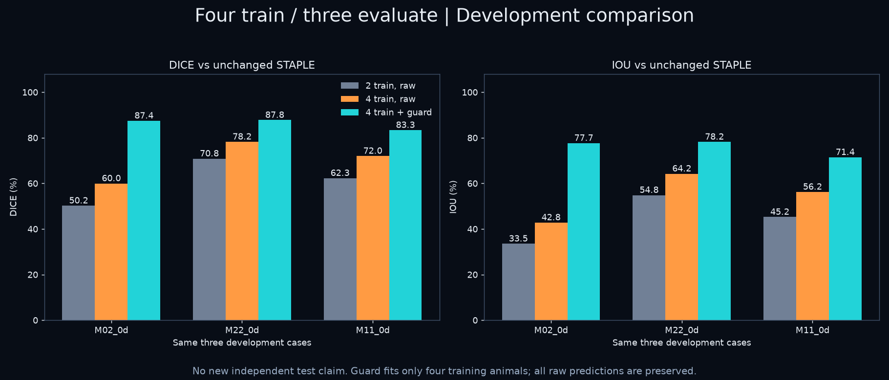
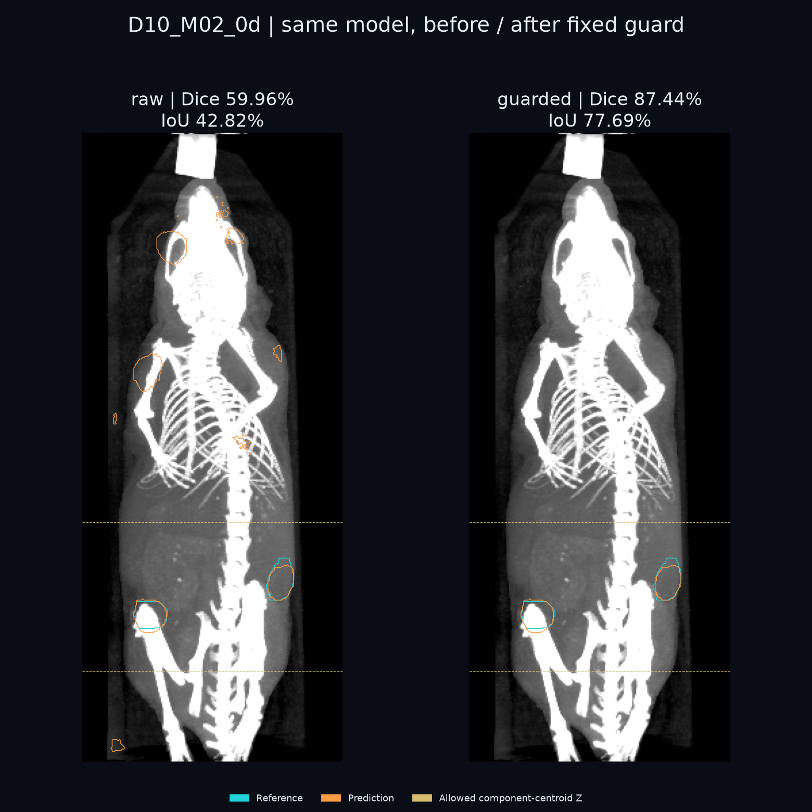

# nnFoundation × TumSeg：从两例微调到四例加远端清理

**思语视觉｜2026-09-26–27 实验记录与复现代码。** 用 nnFoundation-CNN 微调公开 TumSeg 小鼠皮下肿瘤 CT，保留首轮失败结果，再比较增加训练个体和固定空间先验的影响。这是我们自己的少样本实验，不是原 TumSeg 模型或 nnFoundation 论文基准成绩的复现。

## 先看结果

- 首轮 **2 训 / 5 测**：五例平均 Dice **57.54%**、IoU **41.96%**。预先固定的展示例 M07，目标最大切片 Dice 93.81%，整只动物三维 Dice 31.12%；主要错误是远端假阳性。
- 后续沿用七只动物，改成 **4 训 / 3 评估**。这些动物此前已被检查，所以是**开发性复测**，不能称为新的独立测试。
- 在**相同三例 M02 / M22 / M11**上，旧两例模型 → 四例模型 → 四例模型加清理：平均 Dice **61.11% → 70.06% → 86.18%**；IoU **44.53% → 54.43% → 75.77%**。
- 三例中，距参考肿瘤大于 10mm 的假阳性共 **18,642 → 0 体素**。共删去 18,668 个假阳性、0 个真阳性；召回率仍为 81.52%，原有漏分没有被补回。10mm 是事后评价阈值，清理推理不使用参考标注或到真实肿瘤的距离。





所有数字可检查 [evidence/](evidence/)；三例完整图另见 [M22](docs/assets/D10_M22_0d-comparison.png)、[M11](docs/assets/D10_M11_0d-comparison.png)。原始预测保留，不以挑图代替全体积评价。

## 微调设计与变化

输入是单通道三维 CT，输出是同一空间的三维二分类肿瘤掩码。使用 nnFoundation-CNN 的 **3D ResEncL 编码器 + 新分割解码器，整网微调**。两轮都从官方原始预训练权重重新初始化，四例模型没有继续训练两例模型。

- 队列：Dataset 10，0d 基线。首轮按固定种子 `20260926` 对同次采集组做 SHA256 排序，每组取鼠编号最小者；动物及采集组不跨首轮训练/测试集，其他时间点排除。
- 两例训练：`D10_M16_0d, D10_M33_0d`。首轮五例测试：`M07, M19, M02, M22, M11`（均同一 D10/0d 前缀后缀）。
- 四例训练：`M16, M33, M07, M19`；后续评估：`M02, M22, M11`。
- 两轮相同预算：**30 epoch × 50 iteration = 1,500 次优化**，batch 2，128³ patch，SGD 初始学习率 0.001、momentum 0.99、Nesterov，3 epoch 预热。
- 0.21mm 原生分辨率、Z-score；上游推荐 192³，本实验为 16GB GPU 降至 128³。固定最终 checkpoint；训练集监控不作为独立验证，也不按评估成绩选权重。
- 推理使用 CUDA、滑窗、无翻转 TTA。首轮没有后处理；四例输出同时保留 raw 和 guarded。
- 实测 Python 3.12.14、PyTorch 2.7.1+cu126、CUDA 12.6、RTX 4090 Laptop 16GB、系统内存 32GB。两例训练 17.55 分钟，四例 11.92 分钟；峰值 allocated 显存均约 7.69GiB。时间是本机记录，不构成速度对比实验。

## 复现（Windows / PowerShell）

先安装 Git、uv、兼容 CUDA 12.6 的 NVIDIA 驱动。预留约 30GB 以上磁盘空间（环境、2.22GB 原始 ZIP、解压数据、预处理及两个模型），不同缓存情况会变化。

```powershell
git clone https://github.com/siyuvision/ia4u-deep-dive.git
cd ia4u-deep-dive/projects/nnfoundation-tumseg-ct
powershell -ExecutionPolicy Bypass -File install/setup.ps1
```

安装脚本固定 nnU-Net 提交 `202f6baa0adc2ef5f7b615df19cc4da970412cc0`，并使用原实验依赖版本快照。它不会安装其他项目的子模块。也可按脚本逐行执行。训练会向专用 nnU-Net checkout 注册本项目 trainer，请使用独立环境。

1. 从 [TumSeg 官方档案](https://erda.ku.dk/archives/ba4fcd9bfa0fb581d593297dd43d1fd1/published-archive.html) 下载 `TumSeg database.zip`（2,215,359,430 字节）。数据未重复上传到本仓库。SHA256 为 `1c0567358ec81b9e085434a0362c1c2981b791dc2733931aeb022174ecb80399`。
2. 获取 [nnFoundation-CNN 官方权重](https://huggingface.co/MIC-DKFZ/nnFoundationCNN)。可执行下面的显式下载命令（约 410MB），或设置 `$env:NNFOUNDATION_WEIGHTS` 指向已有的 `checkpoint_final.pth`。默认缓存为用户目录 `.cache/siyu-vision-models/nnfoundation/nnFoundationCNN.pth`。

```powershell
$env:PYTHONUTF8='1'
repo/.venv/Scripts/python.exe repo/fetch_weights.py --download
repo/.venv/Scripts/python.exe repo/audit_data.py --archive 'D:/datasets/TumSeg database.zip'
repo/.venv/Scripts/python.exe repo/audit_geometry.py
repo/.venv/Scripts/python.exe repo/prepare_experiment.py
repo/.venv/Scripts/python.exe repo/test_metrics.py
repo/.venv/Scripts/python.exe repo/test_spatial_guard.py

# 首轮：自动完成计划、训练、五例预测和评估
repo/.venv/Scripts/python.exe -u repo/run_pipeline.py
repo/.venv/Scripts/python.exe repo/render_assets.py
repo/.venv/Scripts/python.exe repo/diagnose_existing_results.py

# 第二轮：冻结四/三划分及训练拟合先验；训练、预测、评价、出图
repo/.venv/Scripts/python.exe repo/prepare_fourshot.py
repo/.venv/Scripts/python.exe -u repo/run_fourshot.py
repo/.venv/Scripts/python.exe -u repo/evaluate_fourshot.py
repo/.venv/Scripts/python.exe repo/report_fourshot.py
```

将示例 `D:/datasets/...` 换成自己的文件位置。按顺序执行，每条命令成功后再继续；发生错误时检查日志，勿略过失败步骤。首轮状态在 `experiments/pilot/`，后续在 `experiments/four_train_three_eval_20260927_v1/`。数据准备、协议、已完成模型和预测有存在性保护；重新实验应使用新的项目目录，不覆盖原结果。

原始数据/新输出写到 `data/`、`experiments/`、`results/`，均不进 Git。`evidence/` 是已完成实验的发布快照，不会被复现脚本读取为预测结果。若只检查公式和清理逻辑，运行两个 test 脚本即可，无需数据或 GPU。

## 数据空间信息问题

452 次扫描来自 223 只动物、10 个队列。鼠编号只在队列内唯一；同鼠多个时间点不可当作独立个体。每个 CT 有 A/B/C 三名标注者及 STAPLE 融合参考，四份标签不是四个样本。

全部 2,260 个 NIfTI 文件出现 qform/pixdim（0.21mm）与 sform（1mm）的冲突。两轮训练前，依据论文和 qform，把**实验副本**的两套仿射统一到 0.21mm，逐体素验证内容不变；保留源文件。物理体积和距离必须在统一后的空间计算。初始 `data-audit.json` 记录冲突 sform 体积，修正后的核查结果在 `data-audit-physical.json`，不能混用。

## 远端清理具体做什么

[`spatial_guard.py`](repo/spatial_guard.py) 用 CT 软组织范围 −250～300HU 和 0.42mm 开运算识别主体长轴范围，仅从四例训练 CT/标注拟合肿瘤相对 Z 位置（约 0.206～0.351），向外留 5mm。保留中心处于允许范围且体积不小于约 5.24mm³ 的**整个**预测连通块；体积下限为最小训练目标连通块的 10%。不强制只保留最大块，也不限制肿瘤个数。

应用只需要 CT、原始预测、冻结先验文件，不读评估标签。训练标注逐例留出先验覆盖性检查为 100%；这仅验证规则覆盖训练标注，不等于独立分割性能。队列的 Z 轴身体朝向和体位须一致；没有实现任意体位配准或器官定位。异位、极小病灶或新姿态可能被错误剔除，因此不能作为通用肿瘤清理器。

## 能说明什么

这七只小鼠表明：在此队列及固定小预算下，增加训练个体与针对远端错误的规则，改善了已检查三例的分割重叠。没有从零训练对照、未做多随机种子/置信区间分析，也没有新的外部测试集，因此无法证明预训练的独立收益或跨队列泛化。固定随机种子但启用 cuDNN benchmark；不同环境不保证逐位一致，应检查重新计算的指标。

完整研究流程可重跑；发布时的便携性验证覆盖代码编译、指标/清理测试、权重校验及依赖解析，**没有在全新机器再训练一遍**。它是动物影像研究演示，不是经验证的诊断系统。

## 来源与许可

见 [THIRD_PARTY_NOTICES.md](THIRD_PARTY_NOTICES.md)。本项目适配脚本遵循母仓库 MIT；nnU-Net 为 Apache-2.0；nnFoundation 权重为 CC BY-SA 4.0；TumSeg 档案标为 CC-BY（未注明版本）。这些许可不互相替代。仓库没有重新分发 CT 原始包、预训练或微调权重。
